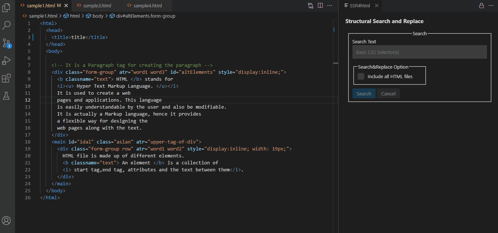

# README: SSR4html - Structural Search and Replace for HTML

SSR4html is an extension for the Visual Studio Code that enables developers to structurally search and replace text in HTML project files. By using SSR4html, developers can save effort and time while editing repetitive HTML elements in HTML files.

In order to show search matches in HTML files, the regular expression, which is generated according to the typed CSS selector, is used. In order to parse and modify search results, a DOM is created for each file. After the DOM modification process, the DOM is converted into its text version and this text is formatted. Subsequently, each file is overwritten according to the text of the DOM. Finally, changes made to the files are automatically saved.

## Features

### Format HTML files
* Open the Command Palette (Ctrl+Shift+P on Windows and Linux, Cmd+Shift+P on macOS) and select the `Format HTML Files` command.

### Launch UI
* Open the Command Palette (Ctrl+Shift+P on Windows and Linux, Cmd+Shift+P on macOS) and select the `Structural Search and Replace` command.

* The UI is launched with an informational message that is asked only once for a workspace. For accurate search results, it is advised to use the `Format` option in this informational message. However, if you don't want the files to be formatted every time the extension is activated, you can select the `Nevermind` option. Then you can manually run the `Format HTML Files` command for more precise search results. Later, this automatic formatting setting can be adjusted under the [extension settings](#extension-settings).

### Structural Search

#### Set Search & Replacement Scope
* Search & Replace in File

* Search & Replace in Workspace

* Exclude Files

#### Search for a Tag Name
* Type Selector (`tagName`)

#### Search for Class Name(s)
* Class Selector (`.className`)

* Multiple Class Selector

#### Search for an Id Value
* Id Selector (`#idValue`)

#### Search for attribute-value pair(s)
* Has Attribute Selector (`[attributeName]`)

* Attribute Equals Selector (`[attributeName=”value”]`)

* Attribute Starts With Selector (`[attributeName^=”value”]`)

* Attribute Contains Selector (`[attributeName*=”value”]`)

* Attribute Ends With Selector (`[attributeName$=”value”]`)

* Attribute Contains Word Selector (`[attributeName~=”value”]`)

* Multiple Attribute Selector

#### Search for multiple features
* Type, Id, Class, and Attribute Selector Together

* Multiple Selector (`selector1, selector2`)

### Structural Replace

#### Class Operations
**Only English letters may be used to start class names, and only colons, dots, English letters, digits, hyphens, and underscores may follow.**

* Set Class (`className className2`)

* Append to Class (`className className2`)

* Remove from Class (`className className2`)

#### Id Operation
**Only English letters may be used to start an id value, and only colons, dots, English letters, digits, hyphens, and underscores may follow.**

* Set Id (`idValue`)

#### Attribute Operations
**Meta-characters such as `!"#$%&'()*+,./:;<=>?@[\]^{|}~` cannot be used for attribute names.**
**All characters except these meta-characters `"`, `'`, `&`, `<`, and `>` may be used for attribute values.**
**Use [style operations](#style-operations) to modify the style attribute.**

* Set Attribute (`attributeName value value2`)

* Append to Attribute (`attributeName value value2`)

* Remove from Attribute (`attributeName value value2`)

* Remove Attribute (`attributeName attributeName2`)

#### Style Operations
**Property-value pairs must be valid.**

* Set Style (`property: value, property2: value2`)

* Edit Style (`property: value, propertyToRemove: null, property2: value2`)

#### Tag Operations
**Only lowercase English letters can be used for a tag name.**

* Edit Tag Name (`tagname`)

**Entering an upper tag name is mandatory but entering an id value, class name or attribute-value pair is optional.**

* Add Upper Tag (`uppertagname#idValue.className[attributeName="value"]`)

* Remove Upper Tag

* Remove Tag

#### One Step Rollback Operation
**It is possible to revert the effects of the last replacement process.** 

#### Auto Rollback Operation
**In case of an erroneous replacement process, SSR4html automatically reverts the last changes.**

## Used External Packages and Limitations

*selector-2-regexp* package, which is written by Yoshiro Matsumoto is used to generate regular expressions based on CSS selectors. In order to search in HTML files in the workspace, you can use all kind of type, class, id and attribute selectors that has showed above in the features part. However, there is a limitation since the sidebar search of the Visual Studio Code does not support regular expressions with look behind assertion. Therefore, using combinator selectors for searching is blocked. Please also note that the generated regular expressions differ from the ones provided by *selector-2-regexp* because the regular expressions provided by *selector-2-regexp* are not fully correct. Therefore, the generated regular expressions are modified.

* [More information about selector-2-regexp](https://github.com/m-yoshiro/Selector2Regexp)

In order to manipulate the related parts of HTML source codes, I wanted to take advantage of the *querySelectorAll()* method. That is why, the *jsdom* package is used to provide Document Object Model (DOM), which is necessary to find and replace the related parts. Therefore, this extension can be only used to replace in HTML files. Otherwise, it may break the structure of the files.

* [More information about jsdom](https://github.com/jsdom/jsdom)

As was mentioned above, the manipulated DOMs of the HTML files are overwritten on old HTML files, which may result in unexpected changes in the format of the documents. Therefore, *pretty* package that helps beautifying HTML with *js-beautify* is used to prevent these side effects and make the source code more readable.

* [More information about pretty](https://github.com/jonschlinkert/pretty)

## Extension Settings

SSR4html contributes the following setting for a workspace:

* `ssr4html.autoFormat`: Enable/disable auto-formatting HTML files on the activation of the extension.

## Known Issues

Generated regular expressions do not capture multi-line HTML elements. Therefore, the [format HTML files](#format-html-files) feature is implemented to convert multi-line elements into single-line elements.

**Enjoy!**